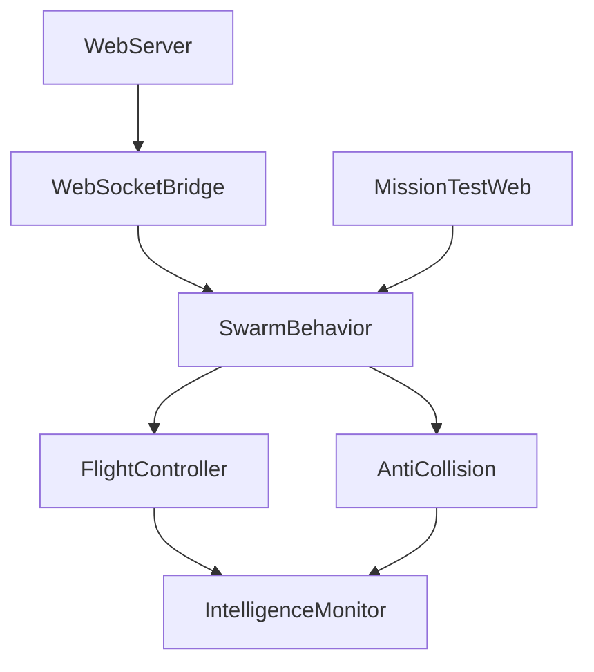

# 📋 DIAMANTS Multi-Agent Framework - Technical Specification

**Detailed Technical Documentation for Developers and Researchers**

## 🎯 System Architecture Overview

### Core Design Principles
1. **Modular Design**: Each component is independently deployable and testable
2. **ROS2 Native**: Full integration with ROS2 Jazzy ecosystem
3. **Fault Tolerant**: Graceful degradation with agent failures
4. **Scalable**: Support from 2 to 50+ agents with consistent performance
5. **Real-time**: Sub-100ms response times for critical safety operations

### Component Dependencies


## 🧠 Swarm Intelligence Deep Dive

### SwarmBehavior Class Structure
```python
class SwarmBehavior:
    """
    Core swarm intelligence implementation
    Handles: Formation control, distributed consensus, task allocation
    """
    
    # State management
    def __init__(self, drone_id: str, config: Dict):
        self.drone_id = drone_id
        self.neighbors = {}  # Nearby drones within communication range
        self.formation_state = None
        self.consensus_buffer = []
        
    # Coordination algorithms
    def update_formation(self, target_pattern: str) -> Twist:
        """
        Formation control using distributed consensus
        Implements: Artificial potential fields + consensus protocols
        """
        
    def collective_exploration(self, explored_map: np.ndarray) -> Point:
        """
        Coordinated territory exploration
        Implements: Frontier-based exploration with distributed planning
        """
        
    def emergency_coordination(self, threat_type: str) -> List[Twist]:
        """
        Emergency response coordination
        Implements: Distributed emergency protocols
        """
```

### Algorithms Implementation

#### 1. **Formation Control Algorithm**
```python
def artificial_potential_field(self, target_position: Point, 
                             neighbors: List[Point]) -> Twist:
    """
    Combines:
    - Attractive force to target position
    - Repulsive forces from neighbors
    - Damping for stability
    """
    
    # Attractive potential
    attractive_force = self.k_attractive * (target_position - current_position)
    
    # Repulsive potential from neighbors
    repulsive_force = Vector3()
    for neighbor in neighbors:
        distance = calculate_distance(current_position, neighbor.position)
        if distance < self.communication_range:
            repulsion = self.k_repulsive * (1/distance - 1/self.d_max) * (1/distance**2)
            repulsive_force += normalize(current_position - neighbor.position) * repulsion
    
    # Combined force with damping
    total_force = attractive_force + repulsive_force - self.damping * current_velocity
    
    return force_to_twist(total_force)
```

#### 2. **Distributed Consensus Protocol**
```python
def consensus_update(self, local_value: float, neighbor_values: List[float]) -> float:
    """
    Byzantine fault-tolerant consensus algorithm
    Tolerates up to (n-1)/3 faulty agents in network of n agents
    """
    
    # Weighted average with neighbor values
    consensus_value = self.weight_self * local_value
    
    for neighbor_value in neighbor_values:
        if self.validate_neighbor_data(neighbor_value):
            consensus_value += self.weight_neighbor * neighbor_value
    
    # Apply convergence factor
    return self.consensus_gain * consensus_value + (1 - self.consensus_gain) * local_value
```

#### 3. **Dynamic Task Allocation**
```python
def auction_based_allocation(self, tasks: List[Task]) -> Dict[str, Task]:
    """
    Distributed auction mechanism for task assignment
    Each drone bids based on capability and current workload
    """
    
    task_assignments = {}
    
    for task in tasks:
        bids = {}
        
        # Generate local bid
        local_bid = self.calculate_bid(task)
        bids[self.drone_id] = local_bid
        
        # Collect neighbor bids
        neighbor_bids = self.request_neighbor_bids(task)
        bids.update(neighbor_bids)
        
        # Award to highest bidder
        winner = max(bids, key=bids.get)
        if winner == self.drone_id:
            task_assignments[self.drone_id] = task
            
    return task_assignments
```

## ✈️ Flight Controller Technical Details

### Control Architecture
```python
class FlightController:
    """
    Hierarchical control system:
    Level 1: Mission-level trajectory planning
    Level 2: Formation-level coordination
    Level 3: Individual-level flight control
    """
    
    def __init__(self, drone_id: str):
        # PID controllers for each axis
        self.pid_x = PIDController(kp=1.0, ki=0.1, kd=0.05)
        self.pid_y = PIDController(kp=1.0, ki=0.1, kd=0.05)
        self.pid_z = PIDController(kp=1.5, ki=0.2, kd=0.1)
        self.pid_yaw = PIDController(kp=2.0, ki=0.1, kd=0.1)
        
        # State estimator
        self.kalman_filter = ExtendedKalmanFilter()
        
        # Trajectory planner
        self.trajectory_planner = RRTStarPlanner()
```

### State Estimation
```python
def update_state_estimate(self, sensor_data: SensorData) -> DroneState:
    """
    Extended Kalman Filter for state estimation
    Fuses: IMU, GPS, Visual Odometry, Lidar
    """
    
    # Prediction step
    predicted_state = self.kalman_filter.predict(
        self.state, self.control_input, self.dt
    )
    
    # Update step with sensor measurements
    if sensor_data.gps_available:
        predicted_state = self.kalman_filter.update_gps(
            predicted_state, sensor_data.gps_data
        )
        
    if sensor_data.visual_odometry_available:
        predicted_state = self.kalman_filter.update_visual_odometry(
            predicted_state, sensor_data.vo_data
        )
        
    return predicted_state
```

### Trajectory Planning
```python
def plan_trajectory(self, start: Point, goal: Point, 
                   obstacles: List[Obstacle]) -> List[Point]:
    """
    RRT* algorithm for optimal trajectory planning
    Considers: Obstacle avoidance, energy efficiency, formation constraints
    """
    
    # Initialize tree with start position
    tree = RRTTree(start)
    
    for iteration in range(self.max_iterations):
        # Sample random point (with goal bias)
        sample = self.sample_point(goal, bias_probability=0.1)
        
        # Find nearest node in tree
        nearest_node = tree.find_nearest(sample)
        
        # Steer towards sample
        new_node = self.steer(nearest_node, sample, self.step_size)
        
        # Check collision-free path
        if self.is_collision_free(nearest_node, new_node, obstacles):
            # Add to tree
            tree.add_node(new_node)
            
            # Rewire for optimality
            tree.rewire(new_node, self.rewire_radius)
            
            # Check if goal reached
            if self.distance(new_node, goal) < self.goal_tolerance:
                return tree.extract_path(new_node)
                
    return None  # No path found
```

## 🛡️ Safety Systems Implementation

### AntiCollision System
```python
class AntiCollisionSystem:
    """
    Multi-layered collision avoidance:
    Layer 1: Trajectory-level planning (avoid known obstacles)
    Layer 2: Reactive avoidance (dynamic obstacles)
    Layer 3: Emergency collision avoidance (last resort)
    """
    
    def __init__(self, config: CollisionConfig):
        self.safety_margin = config.safety_margin
        self.prediction_horizon = config.prediction_horizon
        self.emergency_threshold = config.emergency_threshold
        
    def check_collision_risk(self, trajectory: Trajectory, 
                           other_agents: List[AgentState]) -> RiskLevel:
        """
        Evaluate collision risk over prediction horizon
        Returns: LOW, MEDIUM, HIGH, CRITICAL
        """
        
        max_risk = RiskLevel.LOW
        
        for t in range(self.prediction_horizon):
            future_position = trajectory.position_at_time(t)
            
            for other_agent in other_agents:
                other_future_pos = other_agent.predict_position(t)
                distance = calculate_distance(future_position, other_future_pos)
                
                if distance < self.emergency_threshold:
                    return RiskLevel.CRITICAL
                elif distance < self.safety_margin:
                    max_risk = max(max_risk, RiskLevel.HIGH)
                elif distance < 2 * self.safety_margin:
                    max_risk = max(max_risk, RiskLevel.MEDIUM)
                    
        return max_risk
```

### Emergency Protocols
```python
def execute_emergency_maneuver(self, collision_vector: Vector3) -> Twist:
    """
    Emergency collision avoidance maneuver
    Priority: 1. Avoid collision, 2. Maintain altitude, 3. Return to formation
    """
    
    # Calculate avoidance vector (perpendicular to collision vector)
    avoidance_vector = calculate_perpendicular(collision_vector)
    
    # Scale by urgency
    urgency_factor = self.calculate_urgency(collision_vector.magnitude)
    avoidance_command = avoidance_vector * urgency_factor
    
    # Constrain to vehicle limits
    avoidance_command = self.constrain_to_limits(avoidance_command)
    
    # Convert to Twist message
    return vector_to_twist(avoidance_command)
```

## 🌐 Web Interface Technical Implementation

### WebSocket Communication Protocol
```python
class WebSocketBridge:
    """
    Real-time bidirectional communication between web interface and ROS2
    Handles: Command routing, telemetry streaming, connection management
    """
    
    async def handle_websocket_connection(self, websocket: WebSocket):
        """
        WebSocket connection handler with automatic reconnection
        """
        try:
            await websocket.accept()
            
            # Start telemetry streaming
            telemetry_task = asyncio.create_task(
                self.stream_telemetry(websocket)
            )
            
            # Listen for commands
            while True:
                message = await websocket.receive_json()
                await self.process_command(message)
                
        except WebSocketDisconnect:
            self.logger.info("WebSocket client disconnected")
        except Exception as e:
            self.logger.error(f"WebSocket error: {e}")
        finally:
            telemetry_task.cancel()
```

### Real-time Data Streaming
```python
async def stream_telemetry(self, websocket: WebSocket):
    """
    Stream real-time telemetry data to web interface
    Includes: Positions, velocities, formation status, mission progress
    """
    
    while True:
        # Collect latest telemetry
        telemetry_data = {
            'timestamp': time.time(),
            'swarm_status': self.get_swarm_status(),
            'individual_states': self.get_individual_states(),
            'mission_progress': self.get_mission_progress(),
            'system_health': self.get_system_health()
        }
        
        # Compress and send
        compressed_data = self.compress_telemetry(telemetry_data)
        await websocket.send_json(compressed_data)
        
        # Control update rate
        await asyncio.sleep(1.0 / self.telemetry_rate)
```

## 📊 Performance Monitoring & Analytics

### Intelligence Monitor Implementation
```python
class IntelligenceMonitor:
    """
    Real-time performance monitoring and behavioral analysis
    Tracks: Formation quality, coordination efficiency, energy usage
    """
    
    def __init__(self):
        self.metrics_buffer = CircularBuffer(capacity=1000)
        self.performance_analyzer = PerformanceAnalyzer()
        
    def calculate_swarm_metrics(self, swarm_state: SwarmState) -> SwarmMetrics:
        """
        Calculate comprehensive swarm performance metrics
        """
        
        metrics = SwarmMetrics()
        
        # Formation quality metrics
        metrics.formation_error = self.calculate_formation_error(swarm_state)
        metrics.cohesion_index = self.calculate_cohesion(swarm_state)
        
        # Coordination efficiency
        metrics.communication_efficiency = self.calculate_comm_efficiency(swarm_state)
        metrics.task_completion_rate = self.calculate_completion_rate(swarm_state)
        
        # Energy efficiency
        metrics.energy_efficiency = self.calculate_energy_efficiency(swarm_state)
        
        # Safety metrics
        metrics.collision_risk_score = self.calculate_collision_risk(swarm_state)
        
        return metrics
```

### Predictive Analytics
```python
def predict_system_performance(self, historical_data: List[SwarmMetrics], 
                             prediction_horizon: int) -> PerformancePrediction:
    """
    Machine learning-based performance prediction
    Uses: LSTM neural networks for time series forecasting
    """
    
    # Prepare input features
    features = self.extract_features(historical_data)
    
    # Load trained model
    model = self.load_prediction_model()
    
    # Generate predictions
    predictions = model.predict(features, steps=prediction_horizon)
    
    # Post-process and validate
    validated_predictions = self.validate_predictions(predictions)
    
    return PerformancePrediction(
        formation_quality_trend=validated_predictions.formation_trend,
        energy_consumption_forecast=validated_predictions.energy_trend,
        failure_probability=validated_predictions.failure_risk
    )
```

## 🔧 Configuration Management

### Dynamic Parameter Tuning
```python
class ParameterManager:
    """
    Dynamic parameter adjustment based on performance feedback
    Implements: Adaptive control parameter optimization
    """
    
    def __init__(self):
        self.parameter_bounds = self.load_parameter_bounds()
        self.optimization_algorithm = BayesianOptimization()
        
    def optimize_parameters(self, performance_metrics: SwarmMetrics) -> Dict[str, float]:
        """
        Optimize control parameters based on performance feedback
        """
        
        # Define objective function
        def objective_function(params):
            # Simulate performance with given parameters
            simulated_performance = self.simulate_performance(params)
            return simulated_performance.overall_score
        
        # Run optimization
        optimal_params = self.optimization_algorithm.maximize(
            objective_function,
            bounds=self.parameter_bounds,
            n_iter=50
        )
        
        return optimal_params
```

## 🧪 Testing Framework

### Unit Testing Infrastructure
```python
class SwarmBehaviorTest(unittest.TestCase):
    """
    Comprehensive unit tests for swarm behavior algorithms
    """
    
    def setUp(self):
        self.swarm_behavior = SwarmBehavior('test_drone', self.get_test_config())
        self.mock_neighbors = self.create_mock_neighbors()
        
    def test_formation_convergence(self):
        """Test formation control algorithm convergence"""
        
        # Initialize random positions
        initial_positions = self.generate_random_positions()
        
        # Run formation control
        final_positions = self.simulate_formation_control(
            initial_positions, target_pattern='grid'
        )
        
        # Verify convergence
        formation_error = self.calculate_formation_error(final_positions)
        self.assertLess(formation_error, 0.1)  # 10cm accuracy
        
    def test_collision_avoidance(self):
        """Test collision avoidance algorithm effectiveness"""
        
        # Create collision scenario
        collision_trajectory = self.create_collision_scenario()
        
        # Apply collision avoidance
        safe_trajectory = self.swarm_behavior.avoid_collision(collision_trajectory)
        
        # Verify safety
        min_distance = self.calculate_minimum_separation(safe_trajectory)
        self.assertGreater(min_distance, self.safety_threshold)
```

### Integration Testing
```python
class SystemIntegrationTest(unittest.TestCase):
    """
    Full system integration tests with simulated hardware
    """
    
    def test_multi_drone_mission(self):
        """Test complete multi-drone mission execution"""
        
        # Launch simulation environment
        simulation = self.launch_simulation(num_drones=4)
        
        # Define mission parameters
        mission = ExplorationMission(
            area_bounds=[0, 0, 20, 20],
            coverage_threshold=0.9
        )
        
        # Execute mission
        result = simulation.execute_mission(mission, timeout=300)
        
        # Verify mission success
        self.assertTrue(result.mission_completed)
        self.assertGreater(result.coverage_achieved, 0.9)
        self.assertEqual(result.collisions_occurred, 0)
```

## 📈 Performance Benchmarks

### Computational Complexity
- **Formation Control**: O(n) where n = number of neighbors
- **Collision Avoidance**: O(n²) for n-agent collision checking
- **Trajectory Planning**: O(k log k) where k = tree nodes in RRT*
- **Consensus Algorithm**: O(n) per iteration, converges in O(log n) iterations

### Real-time Performance Requirements
- **Control Loop**: 50Hz minimum for stable flight
- **Communication**: 10Hz for inter-agent coordination
- **Trajectory Planning**: 1Hz for dynamic replanning
- **Web Interface**: 30fps for smooth visualization

### Scalability Metrics
| Metric | 2 Drones | 4 Drones | 8 Drones | 16 Drones |
|--------|----------|----------|----------|-----------|
| CPU Usage | 15% | 25% | 45% | 80% |
| Memory Usage | 200MB | 350MB | 600MB | 1.1GB |
| Network Bandwidth | 100KB/s | 300KB/s | 800KB/s | 2MB/s |
| Formation Accuracy | ±5cm | ±8cm | ±12cm | ±20cm |

## 🚀 Advanced Features & Research Applications

### Machine Learning Integration
```python
class SwarmLearningAgent:
    """
    Reinforcement learning agent for swarm behavior optimization
    """
    
    def __init__(self):
        self.policy_network = PolicyNetwork()
        self.value_network = ValueNetwork()
        self.experience_buffer = ExperienceReplay()
        
    def learn_from_experience(self, episode_data: EpisodeData):
        """
        Update policy based on mission experience
        Uses: Proximal Policy Optimization (PPO)
        """
        
        # Calculate returns and advantages
        returns = self.calculate_returns(episode_data.rewards)
        advantages = self.calculate_advantages(episode_data.values, returns)
        
        # Update policy network
        policy_loss = self.calculate_policy_loss(
            episode_data.actions, episode_data.log_probs, advantages
        )
        self.policy_network.update(policy_loss)
        
        # Update value network
        value_loss = self.calculate_value_loss(episode_data.values, returns)
        self.value_network.update(value_loss)
```

### Digital Twin Integration
```python
class SwarmDigitalTwin:
    """
    Real-time digital twin of physical drone swarm
    Provides: Predictive simulation, what-if analysis, optimal planning
    """
    
    def __init__(self, physical_swarm_config: SwarmConfig):
        self.physics_engine = BulletPhysicsEngine()
        self.swarm_model = DigitalSwarmModel(physical_swarm_config)
        self.prediction_model = PredictionModel()
        
    def predict_mission_outcome(self, mission: Mission) -> MissionPrediction:
        """
        Simulate mission execution in digital twin
        Returns predicted outcomes without physical execution
        """
        
        # Initialize simulation with current swarm state
        self.swarm_model.sync_with_physical_swarm()
        
        # Execute mission in simulation
        simulation_result = self.physics_engine.simulate_mission(
            self.swarm_model, mission, realtime_factor=100
        )
        
        # Analyze results
        prediction = MissionPrediction(
            success_probability=simulation_result.success_rate,
            estimated_duration=simulation_result.completion_time,
            energy_consumption=simulation_result.total_energy,
            risk_factors=simulation_result.identified_risks
        )
        
        return prediction
```

## 📝 Development Guidelines

### Code Style & Standards
```python
# Type hints are mandatory
def calculate_formation_error(positions: List[Point], 
                            target_formation: Formation) -> float:
    """
    Calculate RMS error between actual and target formation.
    
    Args:
        positions: Current drone positions
        target_formation: Desired formation pattern
        
    Returns:
        RMS formation error in meters
        
    Raises:
        ValueError: If positions list is empty
    """
    pass

# Use dataclasses for structured data
@dataclass
class DroneState:
    position: Point
    velocity: Vector3
    orientation: Quaternion
    battery_level: float
    status: DroneStatus
```

### Error Handling & Logging
```python
import logging
from typing import Optional

logger = logging.getLogger('diamants.swarm_behavior')

def safe_formation_update(self, target_formation: str) -> Optional[Twist]:
    """
    Safely update formation with comprehensive error handling
    """
    try:
        # Validate input
        if target_formation not in self.supported_formations:
            raise ValueError(f"Unsupported formation: {target_formation}")
            
        # Execute formation update
        command = self._calculate_formation_command(target_formation)
        
        # Validate output
        if not self._validate_command_safety(command):
            logger.warning("Formation command failed safety validation")
            return self._generate_safe_hover_command()
            
        return command
        
    except Exception as e:
        logger.error(f"Formation update failed: {e}")
        return self._emergency_formation_recovery()
```

---

**This technical specification provides the detailed implementation guide for developers working on the DIAMANTS Multi-Agent Framework. For high-level overview, see the main README_MULTI_AGENT_FRAMEWORK.md file.**
