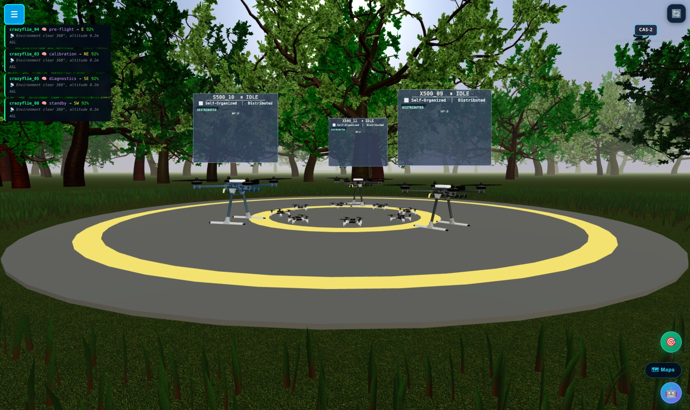
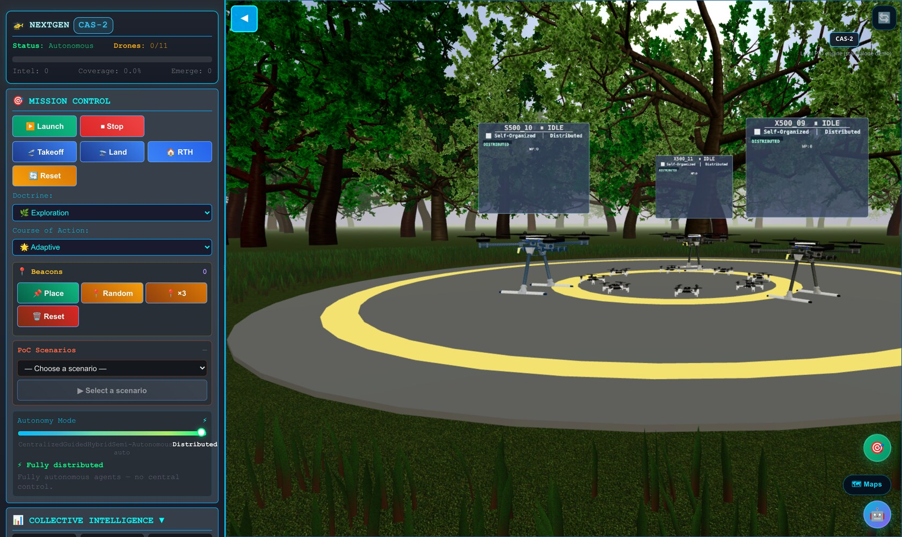
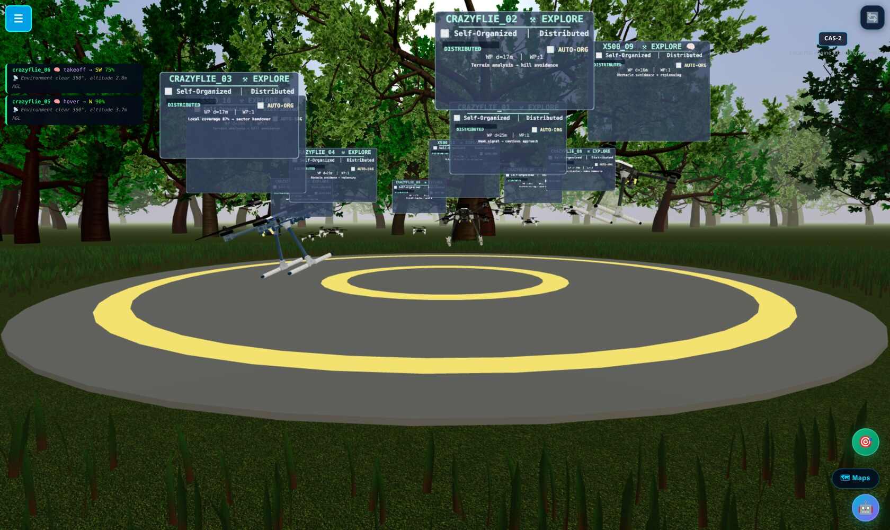
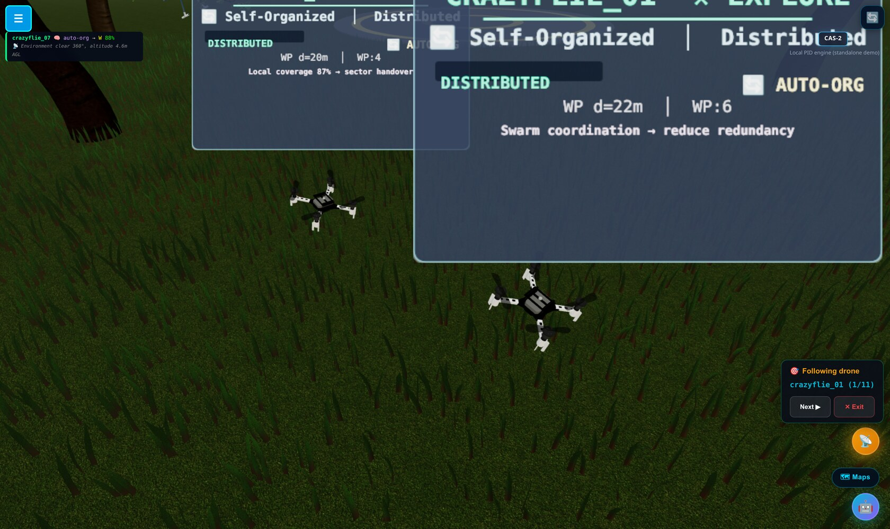
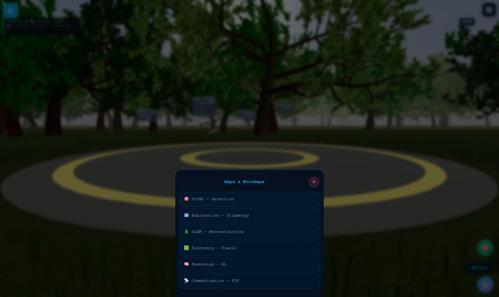
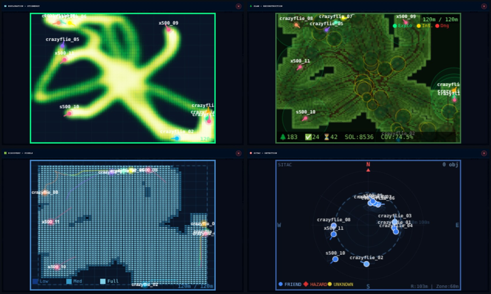

# DIAMANTS

**Fly a drone swarm in your browser, and plug in your own intelligence.**

A fleet takes off from a helipad in a forest and explores on its own. Rendering,
flight physics and collision avoidance are handled. You bring the coordination
algorithm.

> **PolyForm Noncommercial 1.0.0** — free for research, teaching, personal and
> non-profit use. Commercial use is not permitted. See [LICENSE](LICENSE).



*A heterogeneous fleet on the helipad. Every drone carries its own status panel
(id, phase, autonomy mode). Larger X500/S500 platforms and Crazyflie
micro-drones fly side by side, each with its own physics profile.*



*The control panel. Launch a mission, switch flight doctrine and course of
action on the fly, drop beacons, or slide the autonomy from centrally guided to
fully distributed — where the agents coordinate with no central control.*



*Launch, and the fleet fans out on its own. Every drone carries its own panel —
phase, waypoint, autonomy mode and a live rationale — so you can watch eleven
agents decide in parallel. Wire in your own algorithm and this is where it shows.*



*Lock the camera onto any drone and ride along. The follow view cycles through
the whole fleet (1/11, 2/11 …) — handy for debugging a single agent's behaviour
while the rest keep exploring.*

---

## Live maps

The **Maps** button (bottom-right) opens a picker of six live views. Every one
is fed in real time by the drones themselves — open one, launch a mission, and
watch it fill in. No backend required.





| View | What it shows |
|---|---|
| **Exploration — Stigmergy** | A pheromone-style heat-trail of everywhere the fleet has flown — the swarm's shared memory of the terrain. |
| **SLAM — Reconstruction** | The forest rebuilt from the drones' sensors, canopy and obstacles filling in with a live coverage %. |
| **Discovery — Pixels** | An occupancy grid, each cell shaded from *Low* to *Full* as the area gets covered. |
| **SITAC — Detection** | A tactical radar: range rings, headings, and friend / hazard / unknown markers. |
| **Federated — RL** | Model-sharing and convergence between the agents. |
| **Communication — P2P** | The peer-to-peer link graph as drones come in and out of range. |

Each view opens fullscreen, or docks as a small draggable, resizable minimap so
you can keep several on screen while a mission runs.

---

## Getting started

Node.js 20 or newer, and a browser with WebGL 2.

```bash
git clone https://github.com/lololem/diamants-collab.git
cd diamants-collab/DIAMANTS_FRONTEND/Mission_system
npm install
npm run dev
```

Vite prints the address to open, usually **http://localhost:5550**.

```bash
npm run build      # production build
npm test           # test suite
```

A black screen usually means hardware acceleration is off in the browser.

---

## What is not included

Part of the research work stays in a private repository. **Seven modules are
empty shells** — right shape, callable, but inert. Drones fly, explore and avoid
obstacles; their collective intelligence is what is missing.

| Module | Missing behaviour |
|---|---|
| `stigmergy-engine.js` | no pheromones laid or followed |
| `distributed-swarm-engine.js` | no coordinated autonomous agents |
| `swarm-comm-manager.js` | drones do not share their map |
| `drone-intelligence.js` | no local language model calls |
| `scenario-engine.js` | empty scenario list |
| `optimized-search.js` | hierarchical search absent |
| `core/diamants-formulas.js` | field metrics stay at zero |

Writing your own is the intended use. Contracts are in
`intelligence/swarm-intelligence-interface.js` and
`intelligence/stigmergy-interface.js`.

The ROS 2 backend and WebSocket gateway are not published. The frontend runs
standalone.

The "LLM Intelligence" panel expects a local [Ollama](https://ollama.com) server.
Without one it shows **simulated** decisions for demonstration — not model
output.

---

## Layout

```
DIAMANTS_FRONTEND/Mission_system/     the whole application
  physics/        PID flight engine, drone profiles
  intelligence/   swarm interfaces and shells
  environment/    terrain, vegetation, sky
  shaders/        grass and sky (GLSL)
  drones/         3D models
  ui/             panels, minimaps
  assets/         meshes and textures
DEMO/                                 videos and sample data
```

---

## Adding a drone

Drop a JSON file into `physics/profiles/` — the engine loads everything it finds
there at startup.

```json
{
    "id": "MY_DRONE",
    "label": "My Custom Drone",
    "physical":    { "mass": 0.5, "armLength": 0.15, "boundingRadius": 0.4, "propCount": 4 },
    "performance": { "maxSpeed": 5.0, "maxClimb": 2.0, "cruiseAlt": 5.0, "maxAlt": 20.0,
                     "agility": 1.2, "explorationRadius": 80, "endurance_min": 15 },
    "pid": {
        "pos": { "kp": 2.5, "ki": 0.05, "kd": 1.0 },
        "alt": { "kp": 3.5, "ki": 0.1,  "kd": 1.2 },
        "yaw": { "kp": 2.0, "ki": 0.0,  "kd": 0.3 }
    },
    "visual": { "scale": 20, "color": "0xFF6600", "model": "generic" }
}
```

`id`, `label`, `physical`, `performance` and `pid` are required. Full schema in
`profiles/drone-profile.schema.json`.

---

## Plugging in an algorithm

```javascript
import { SwarmIntelligenceInterface } from './swarm-intelligence-interface.js';

export class MySwarmAlgorithm extends SwarmIntelligenceInterface {
    initialize(config) {
        // once at startup: { droneCount, arena, profiles }
    }

    computeInfluences(droneStates, dt) {
        // every frame
        // in:  Map<id, {position, velocity, target, ...}>
        // out: Map<id, {targetModifier, velocityBias, priorityOverride}>
        return new Map();
    }
}
```

**You observe and suggest, the PID controller decides.** Output is merged with
the flight command, not substituted for it — stability is not your problem.

---

## Stack

Three.js 0.167, Vite 4.5, Vitest, ES modules, Node 20+.

---

## Videos

[3D frontend](https://www.youtube.com/watch?v=fyEmYu4lbzo) ·
[Multi-agent systems](https://www.youtube.com/watch?v=1Av_o-9fzrE) ·
[Gradient navigation](https://www.youtube.com/watch?v=ElABxOde6ak) ·
[Swarm coordination](https://www.youtube.com/watch?v=L8V64LajM2w) ·
[Stigmergy](https://www.youtube.com/watch?v=SyqeRwcbDO4)

---

## Contributing

Drone profiles, swarm algorithms, rendering improvements, bug fixes, tests, docs.
Fork, branch, pull request — see [Contributing.md](Contributing.md).
Contributions are distributed under the project licence.

---

## Licence

**PolyForm Noncommercial 1.0.0** — [LICENSE](LICENSE).

Research, teaching, learning, non-profit: yes. Commercial product, paid service,
integration into an offering: no.

Bundled third-party components keep their own licence, listed at the end of the
LICENSE file.

---

[Open an issue](https://github.com/lololem/diamants-collab/issues)
