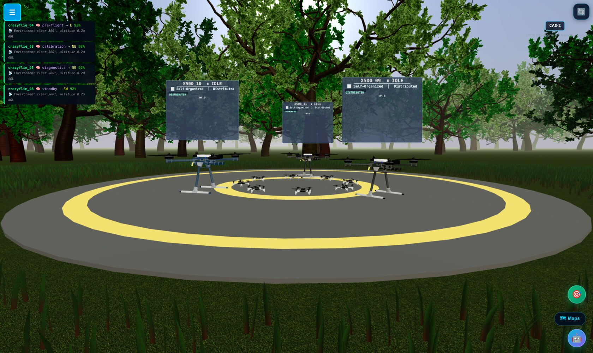
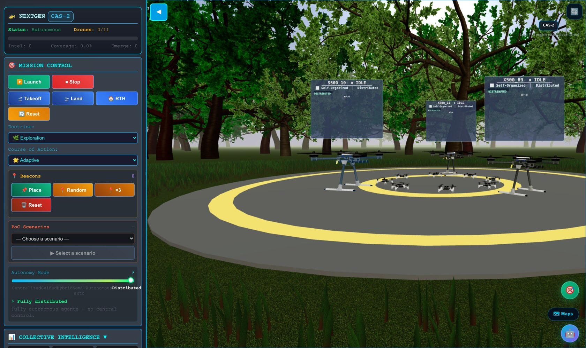
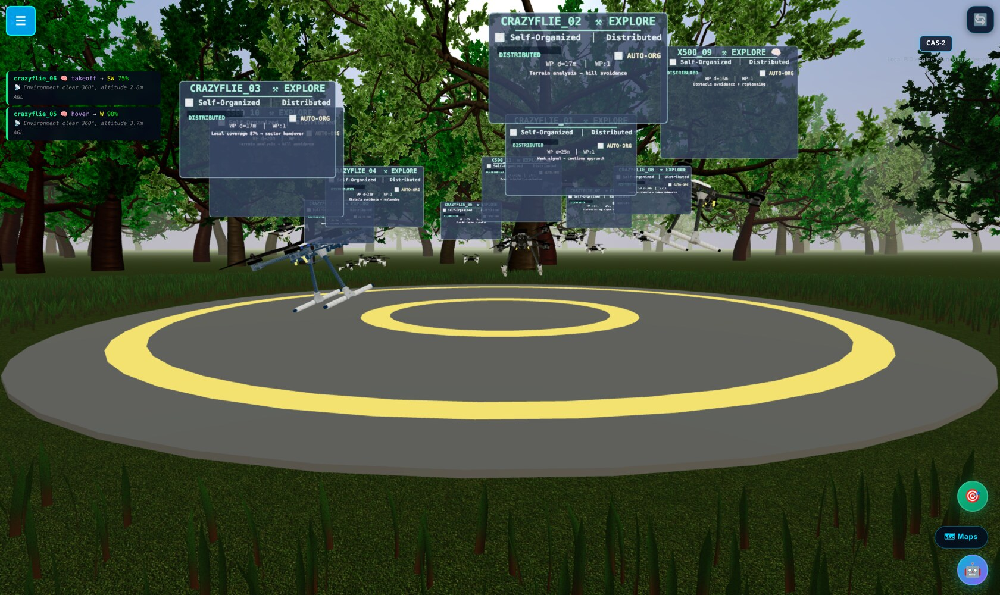
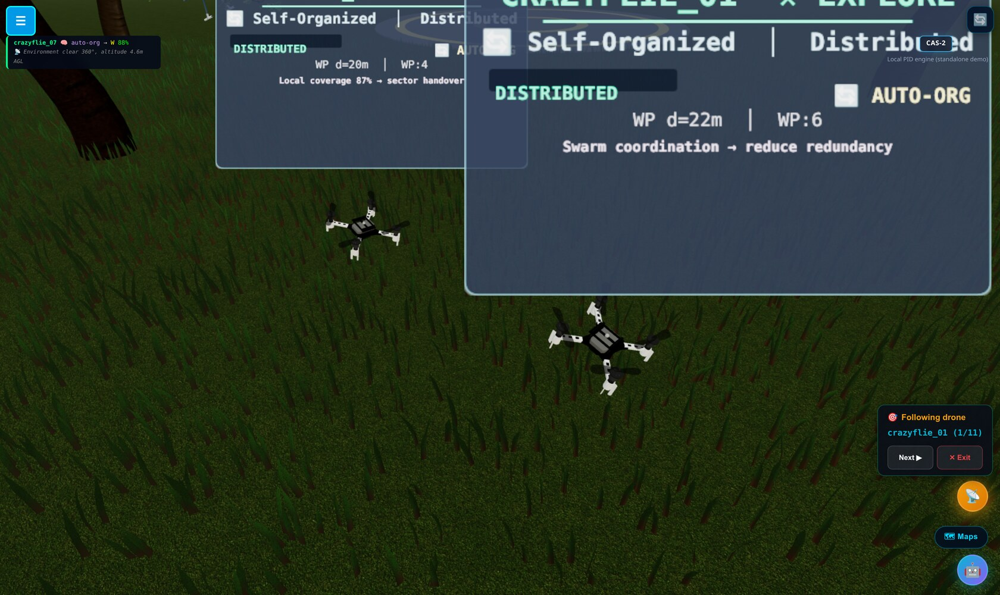
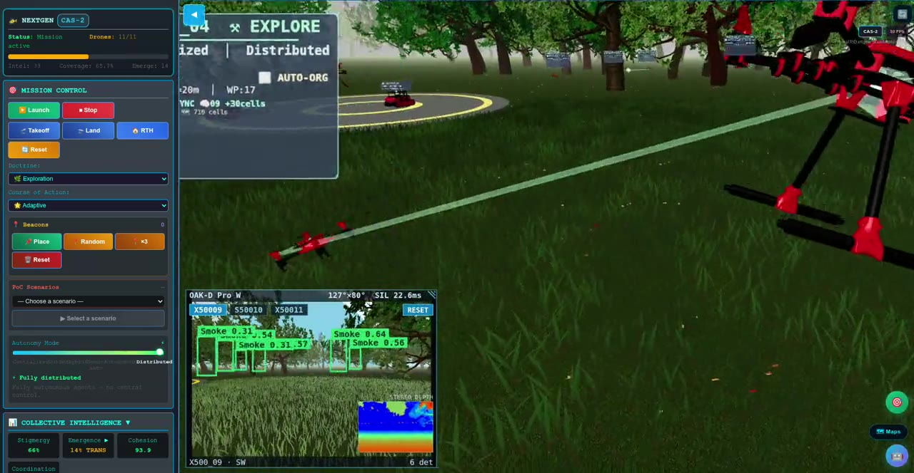
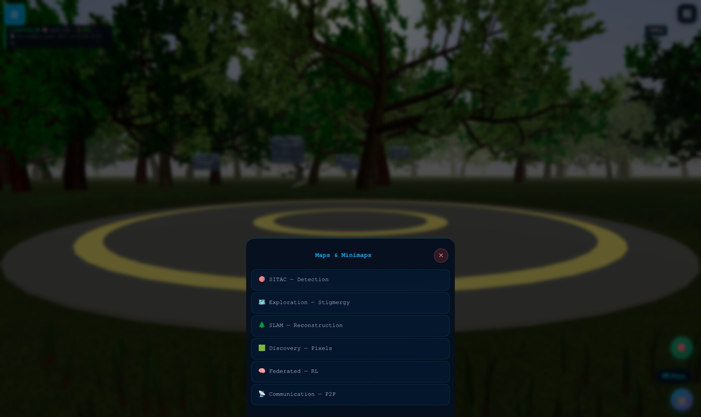
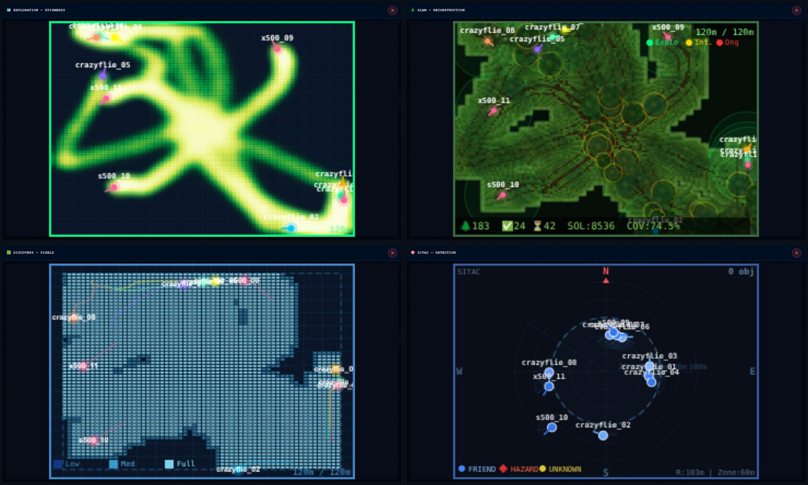

# DIAMANTS

**Fly a drone swarm in your browser, and plug in your own intelligence.**

A fleet takes off from a helipad in a forest and explores on its own. Rendering,
flight physics and collision avoidance are handled. You bring the coordination
algorithm — **and your own drone and your own model**: a language model, a
reinforcement-learning policy, any decision maker, kept in check by symbolic
rules. See [Bring your own model](#bring-your-own-model-neurosymbolic).

> 🎬 **New: five demonstration films (September 2026)** — [▶ watch them online](https://lololem.github.io/diamants-collab/), or see [Demonstration films](#demonstration-films-september-2026) below.
> They were recorded from the current internal development version: **the code published here is not up to date** and does not include every capability shown in them.
>
>
> [](https://diamants-hypervision.pages.dev) [](https://lololem.github.io/diamants-collab/)
>
> <sub>The live demo lets you try DIAMANTS in your browser — it is not up to date either compared with the demonstration films.</sub>

### Why wildfire

A forest fire is cheap to stop and ruinous to chase. In its first minutes one
vehicle and a few hundred litres are enough; an hour later it takes a squadron,
and the outcome no longer depends on you. The difficulty was never the water —
it is knowing *where* to send it, across terrain that swallows radio and has no
roads, faster than the front moves.

That is a search problem before it is a firefighting one, and it is a poor fit
for a single operator watching a single feed. It suits a swarm: many cheap
sensors covering ground in parallel, a few better ones to confirm what the cheap
ones flagged, and heavy machines committed only once there is something real to
attack. Each tier does what it is actually equipped for, and no link in the
chain is allowed to become the one that breaks it.

This simulation runs that mission end to end.

https://github.com/lololem/diamants-collab/raw/main/docs/video/wildfire-mission.mp4

> **Eleven drones, two tracked UGVs, one wildfire — and nobody in charge.**
> Micro-drones sweep the forest and flag what they cannot identify. Camera
> platforms fly out, confirm the fire with a YOLO detector running on their own
> pixels, and put it on the radio. A ground vehicle elects itself, drives in, and
> does not open its water monitor until its thermal camera holds the flame.
> [How it works ↓](#wildfire-response-three-tiers-no-dispatcher)

> ⚠️ **Preview — this code is not in this repository yet.** The wildfire mission
> shown above (task network, onboard perception, ground vehicles, fire and
> suppression physics) is still being finalised and has not been published here.
> What you can run today is the swarm exploration simulator documented below.

> **PolyForm Noncommercial 1.0.0** — free for research, teaching, personal and
> non-profit use. Commercial use is not permitted. See [LICENSE](LICENSE).



*A heterogeneous fleet on the helipad. Every drone carries its own status panel
(id, phase, autonomy mode). Larger X500/S500 platforms and Crazyflie
micro-drones fly side by side, each with its own physics profile.*



*The control panel. Launch a mission, switch flight doctrine and course of
action on the fly, drop beacons, or slide the autonomy from centrally guided to
fully distributed — where the agents coordinate with no central control.*



*Launch, and the fleet fans out on its own. Every drone carries its own panel —
phase, waypoint, autonomy mode and a live rationale — so you can watch eleven
agents decide in parallel. Wire in your own algorithm and this is where it shows.*



*Lock the camera onto any drone and ride along. The follow view cycles through
the whole fleet (1/11, 2/11 …) — handy for debugging a single agent's behaviour
while the rest keep exploring.*

---

## Wildfire response: three tiers, no dispatcher

> **Not shipped yet.** This mission is running, filmed and described here, but
> its code is still being finalised and is not part of this repository. Nothing
> below can be cloned and run today — treat it as a look ahead, not a feature
> list.



*The onboard view, bottom left: what the cognitive drone's OAK-D Pro W actually
sees, with the detector's boxes drawn on it and a stereo depth map in the
corner. [Full run, 2 min 28](docs/video/wildfire-mission.mp4).*

Three kinds of agent, three jobs. Nobody hands out assignments: every decision
is made locally, and the mission falls out of it.

**Crazyflie — survey.** The micro-drones carry no camera. They split the area
between themselves — each derives its own lane from its rank among its peers,
so the division needs no coordinator — and sweep it boustrophedon, lifting the
fog of war. Passing near a heat source, a Crazyflie raises an **unconfirmed
contact**. It cannot tell a fire from a hot roof, and it does not pretend to.

**X500 / S500 — inspect and confirm.** The cognitive platforms carry an OAK-D
Pro W depth camera. Each claims the nearest open contact — again by local
comparison — flies out to look, and runs a real YOLO detector on the pixels its
own camera produces. The boxes you see in the picture-in-picture come from
inference on those pixels, not from the scene graph. A fire is confirmed only
by the detector, together with a stereo range fix, and the confirmation goes out
on the radio.

**Colossus — suppress.** The tracked UGVs hear the broadcast and one elects
itself: the closest free vehicle takes the call. It drives to a standoff, and
its own thermal camera must hold flame in its field of view before the water
monitor opens — a radio report is a vector to the area, never a firing solution.
The jet is ballistic, and the fire goes out because water reaches it, not
because a timer expired. The rover then holds position, re-scans, and only
declares the fire out once its optics stay clear.

Information travels **upward** — Crazyflie to X500, X500 to Colossus — as
contacts and confirmations, never as orders coming down. Take any agent out and
the rest carry on.

---

## Live maps

The **Maps** button (bottom-right) opens a picker of six live views. Every one
is fed in real time by the drones themselves — open one, launch a mission, and
watch it fill in. No backend required.





| View | What it shows |
|---|---|
| **Exploration — Stigmergy** | A pheromone-style heat-trail of everywhere the fleet has flown — the swarm's shared memory of the terrain. |
| **SLAM — Reconstruction** | The forest rebuilt from the drones' sensors, canopy and obstacles filling in with a live coverage %. |
| **Discovery — Pixels** | An occupancy grid, each cell shaded from *Low* to *Full* as the area gets covered. |
| **SITAC — Detection** | A tactical radar: range rings, headings, and friend / hazard / unknown markers. |
| **Federated — RL** | Model-sharing and convergence between the agents. |
| **Communication — P2P** | The peer-to-peer link graph as drones come in and out of range. |

Each view opens fullscreen, or docks as a small draggable, resizable minimap so
you can keep several on screen while a mission runs.

---

## Getting started

Node.js 20 or newer, and a browser with WebGL 2.

```bash
git clone https://github.com/lololem/diamants-collab.git
cd diamants-collab/DIAMANTS_FRONTEND/Mission_system
npm install
npm run dev
```

Vite prints the address to open, usually **http://localhost:5550**.

```bash
npm run build      # production build
npm test           # test suite
```

A black screen usually means hardware acceleration is off in the browser.

---

## What is not included

This repository publishes what you need to **fly a swarm, add your own drone
and plug your own model** — and nothing beyond it. The research work stays in a
private repository.

**What flies here:** the PID flight engine and its state machine (take-off,
exploration, obstacle avoidance, return, landing), the 3D environment, the
sensors, the panels and maps, the beacons, and the neurosymbolic contract with
its providers.

**What is a shell** — right shape, callable, inert:

| Module | Missing behaviour |
|---|---|
| `stigmergy-engine.js`, `stigmergy-loader.js` | no trace laid or followed; the tuned constants are not published |
| `distributed-swarm-engine.js` | no coordinated autonomous agents |
| `swarm-comm-manager.js` | drones do not share their map |
| `drone-intelligence.js` | the internal language-model bridge |
| `scenario-engine.js` | empty scenario list |
| `optimized-search.js` | hierarchical search absent |
| `core/diamants-formulas.js` | field metrics stay at zero |
| `intelligence/collective-intelligence.js`, `advanced-collective-intelligence.js` | consensus map, emergent patterns, attractors |
| `behaviors/collaborative-scouting.js` | trace-based coverage |
| `agent/multi-agent-coordinator.js`, `agent/brain-interface.js`, `agent/agent-drone-registry.js` | the trainable multi-agent layer: learning agents, the protocol they learn, cooperative reward, weight transfer |
| `ui/marl-training-panel.js` | the training console |
| `services/llm-mission-service.js` | turning an operator sentence into a mission |

Writing your own is the intended use. Contracts are in
`intelligence/agent-model-interface.js` (your model),
`intelligence/swarm-intelligence-interface.js` (your coordination),
`intelligence/stigmergy-interface.js` (your traces) and
`agent/brain-interface.js` (your decision maker).

The ROS 2 backend and WebSocket gateway are not published. The frontend runs
standalone.

The "LLM Intelligence" panel expects a local [Ollama](https://ollama.com) server.
Without one, and without your own models plugged in (see
[Bring your own model](#bring-your-own-model-neurosymbolic)), it shows
**simulated** decisions for demonstration — not model output.

The demonstration films were recorded on the internal build and show behaviour
this code does not have: shared traces, a distributed journal, on-board models.
They are there to show what the contracts are for, not what you get by cloning.

---

## Layout

```
DIAMANTS_FRONTEND/Mission_system/     the whole application
  physics/        PID flight engine, drone profiles
  intelligence/   swarm interfaces, shells, and the bring-your-own-model contract
    agent-model-interface.js    Observation → model → rules → decision
    neurosymbolic-bridge.js     connects your models to the running simulator
    model-providers/            ollama, openai-compatible, http-policy, example rules
  environment/    terrain, vegetation, sky
  shaders/        grass and sky (GLSL)
  drones/         3D models
  ui/             panels, minimaps
  assets/         meshes and textures
```

---

## Adding a drone

Drop a JSON file into `physics/profiles/` — the engine loads everything it finds
there at startup.

```json
{
    "id": "MY_DRONE",
    "label": "My Custom Drone",
    "physical":    { "mass": 0.5, "armLength": 0.15, "boundingRadius": 0.4, "propCount": 4 },
    "performance": { "maxSpeed": 5.0, "maxClimb": 2.0, "cruiseAlt": 5.0, "maxAlt": 20.0,
                     "agility": 1.2, "explorationRadius": 80, "endurance_min": 15 },
    "pid": {
        "pos": { "kp": 2.5, "ki": 0.05, "kd": 1.0 },
        "alt": { "kp": 3.5, "ki": 0.1,  "kd": 1.2 },
        "yaw": { "kp": 2.0, "ki": 0.0,  "kd": 0.3 }
    },
    "visual": { "scale": 20, "color": "0xFF6600", "model": "generic" }
}
```

`id`, `label`, `physical`, `performance` and `pid` are required. Full schema in
`profiles/drone-profile.schema.json`.

Restart `npm run dev` and your drone is in the registry. Put one in the air
from the browser console — it flies on the same PID engine and state machine as
the built-ins, and if your profile has an entry in the model registry, that
model starts deciding for it straight away:

```javascript
DIAMANTS.spawnDrone('my_drone_01', 'MY_DRONE', { x: 6, y: 0.4, z: 6 });
takeoffAllDrones();
```

To have it in the fleet from the start instead, name it in `fleet_config.json`. A profile the role table does not know flies as a hybrid
explorer — no other file to edit.

**Checked end to end**: a fresh clone, `npm install`, a new profile dropped in,
`npm run dev` — eleven drones take off and explore, the new profile spawns and
flies, two model providers answer in parallel and a battery rule still imposes
its landing.

---

## Plugging in an algorithm

```javascript
import { SwarmIntelligenceInterface } from './swarm-intelligence-interface.js';

export class MySwarmAlgorithm extends SwarmIntelligenceInterface {
    initialize(config) {
        // once at startup: { droneCount, arena, profiles }
    }

    computeInfluences(droneStates, dt) {
        // every frame
        // in:  Map<id, {position, velocity, target, ...}>
        // out: Map<id, {targetModifier, velocityBias, priorityOverride}>
        return new Map();
    }
}
```

**You observe and suggest, the PID controller decides.** Output is merged with
the flight command, not substituted for it — stability is not your problem.

---

## Bring your own model (neurosymbolic)

Anyone can put **their own drone** (a JSON profile, above) **with their own
model** into the swarm. The model can be anything that turns what a drone
knows into a proposed decision:

- a language model served by Ollama, llama.cpp, vLLM, LM Studio…
- a reinforcement-learning policy, an ONNX network, a planner behind an HTTP endpoint;
- a provider you write yourself in a few lines.

### The model proposes, the rules dispose

A model is never trusted with the aircraft. Every decision goes through a
symbolic rule layer — that is what *neurosymbolic* means here:

```
 Observation ──► rules.before ──► model.decide ──► rules.after ──► bounded influence
 (own view:           │ veto              (neural)         │ reject        on the waypoint
  neighbours,         ▼                                    ▼               — the PID flies
  battery, …)   imposed action                     reactive fallback
```

| Step | Who | What happens |
|---|---|---|
| `rules.before` | symbolic | critical situations (battery, separation…) **veto**: the action is imposed, the model is not even asked |
| `model.decide` | your model | returns `{ action, direction, confidence, reasoning }` — or `null` |
| `rules.after` | symbolic | action not allowed for this drone, unknown direction, low confidence → **rejected** |
| engine | physics | an accepted decision shifts the next waypoint by at most 8 m, clamped to the arena |

A model that times out, answers garbage or proposes something forbidden
changes nothing: the drone keeps flying on its reactive behaviour. **Swap the
model, keep the rules** — a better model never needs the safety behaviour to be
re-validated.

### In three steps

**1. Your drone** — `physics/profiles/my-drone.json` (see [Adding a drone](#adding-a-drone)).

**2. Your model** — copy the registry and give each profile id a provider:

```bash
cd DIAMANTS_FRONTEND/Mission_system/intelligence/model-providers
cp agent-models.example.json agent-models.json     # git-ignored
```

```json
{
  "X500": {
    "provider": "ollama",
    "model": "my-drone-model:latest",
    "allowedActions": ["EXPLORE", "AVOID", "HOVER", "RTL", "REPLAN", "COORDINATE"],
    "minConfidence": 0.6,
    "systemPrompt": "You are an X500 survey drone. Answer with one JSON object: {\"action\", \"direction\", \"confidence\", \"reasoning\"}"
  },
  "MY_DRONE": {
    "provider": "http-policy",
    "name": "ppo-explorer-v3",
    "url": "http://localhost:9000/decide",
    "allowedActions": ["EXPLORE", "AVOID", "HOVER", "RTL"],
    "timeoutMs": 2000
  }
}
```

Several profiles can run **different models at the same time** — that is the
point: heterogeneous agents, one contract. Profiles without an entry fly without
a model. `_settings.maxConcurrent` (default 2) caps requests in flight for the
whole swarm: a local server answers one at a time, so past the cap a drone skips
that thought instead of queueing into a timeout. Rule vetoes are never skipped.

> `agent-models.json` is read from the **dev server only** and never bundled
> into `npm run build` output. Keep API keys there or in your server's own
> config — never in a committed file.

### Or do it from the interface

`npm run dev`, then open **🚁 Fleet & models** (bottom right). It does the same
thing without touching a file, while the simulation runs:

- load or paste a drone profile, and put one in the air — it flies with the
  airframe your profile names (`visual.model`: `x500`, `s500`, `crazyflie`);
- pick a provider and a model for that profile — the model list is read from
  your Ollama server, not typed from memory — and apply it to the fleet;
- watch the counters: decisions accepted, rejected, vetoed by the rules.

The files remain the way to make it permanent; the panel is how you try
something in a few seconds. The tutorial film below does exactly this.

**3. Run** — `npm run dev`. When `agent-models.json` exists, the controller
replaces the inert LLM shell by `neurosymbolic-bridge.js`; the console prints
`Own models attached: N drones`. They start enabled; the **LLM ON/OFF** button
of the *LLM Intelligence* panel pauses and resumes them. Every decision, veto
and rejection appears in its feed with the model name and latency.

Hot-swap from the browser console, rules untouched:

```javascript
const mgr = diamantsSystem.integratedController.droneIntelligenceManager;
mgr.setModelForType('X500', 'my-drone-model-v2:latest');
mgr.getStats();   // { requests, accepted, rejected, vetoes, failures, activeBrains }
```

### Writing a provider

```javascript
import { AgentModel } from '../agent-model-interface.js';
import { registerProvider } from './index.js';

class MyPolicy extends AgentModel {
    get name() { return `mine:${this.config.checkpoint}`; }
    async decide(observation, { allowedActions, signal }) {
        // observation = { agentId, agentType, phase, position{x,z,alt}, speed,
        //                 battery, neighbours[{id,dist,dir}], sharedFindings[], coverage }
        // pass `signal` to fetch(): on timeout the request is cancelled server-side
        return { action: 'EXPLORE', direction: 'NE', confidence: 0.8, reasoning: 'frontier NE' };
    }
}
registerProvider('my-policy', MyPolicy);   // then "provider": "my-policy" in agent-models.json
```

### Writing your rules

`model-providers/example-rules.js` is a deliberately small example (battery
veto, separation veto, allowed actions, confidence threshold). Extend
`RuleLayer` with your own and pass it to `NeuroSymbolicIntelligenceManager`.
The rules are the part to review and test — whatever model sits behind them.

### Making a better model

A general-purpose language model knows language, not your drone. Asked *"battery
21 %, home is north, what now?"* it may answer in prose, invent an action, or
ignore the battery. Two ways to do better, both compatible with the contract:

- **Prompt and rules first.** A tighter system prompt in your registry entry, and
  stricter rules in your `RuleLayer`, already remove most of the nonsense — and
  cost nothing to try.
- **Fine-tune a small model on your own examples.** Continuing the training of a
  small instruct model on *(situation → decision)* pairs turns the behaviour into
  a reflex. LoRA adapters make this cheap on a single consumer GPU
  ([Unsloth](https://github.com/unslothai/unsloth), Hugging Face PEFT), and
  `ollama create` serves the result under a name you put in the registry.

Whatever you train, **measure it before you swap it in**: keep situations the
model never saw, and count valid answers, allowed actions and unsafe proposals.
`NeuroSymbolicAgent.stats` gives you accepted / rejected / vetoed counts at
runtime, and the rules stay in the loop either way.

The teacher rules, the training set and the pipeline of the research build are
not published.

---

## Stack

Three.js 0.167, Vite 4.5, Vitest, ES modules, Node 20+.

---

## Videos

### Demonstration films (September 2026)

**▶ Online player: [https://lololem.github.io/diamants-collab/](https://lololem.github.io/diamants-collab/)**

[](https://diamants-hypervision.pages.dev) [](https://lololem.github.io/diamants-collab/)

<sub>Try DIAMANTS directly in your browser with the live demo — note that it is not up to date either compared with the demonstration films.</sub>

<sub>**What it takes to run the code:** Node 20 and a browser with WebGL — nothing else. A local model server is optional: with none reachable, the eleven drones still take off and explore, and the model field simply offers no suggestions. Checked on a fresh clone.</sub>

> ⚠️ **Films 1 to 4 are demonstration videos**, recorded from the internal development version: **the code published here does not include every capability shown in them.** The tutorial below is the exception — it was recorded on this repository, as you receive it.

#### Tutorial: add your drone and your model (4 min) — [▶ watch online](https://lololem.github.io/diamants-collab/#tutorial) · [download 1080p](https://github.com/lololem/diamants-collab/releases/download/demo-videos-2026-09/DIAMANTS-tutorial-add-your-drone-and-your-model.mp4)

[](https://lololem.github.io/diamants-collab/#tutorial)

Recorded on **this** repository, as you receive it. Five steps, all done on screen in the **Fleet & models** panel:

- **Hardware as a File:** A drone is one JSON profile — a `physical` block, a `performance` block, PID gains, and the airframe it flies. Load it from the panel and the aircraft joins the swarm in flight, without touching a line of code.
- **Authentic Airframe & Flight Logic:** That profile flies a real PX4 mesh, under the same physics and the same eight-state flight logic as the rest of the fleet.
- **Your Own Model, Served Locally:** The model list is read from the Ollama server running on your machine. Apply one to a profile and that drone starts proposing actions, each capped at an 8-metre nudge on the computed waypoint.
- **Rules Outrank the Model:** A battery forced to 8 % triggers a safety rule that imposes the landing before the model is even asked. The last chapter shows how to plug in your own provider — a reinforcement-learning policy or any HTTP endpoint, not only a language model.

#### Film 1: Unmapped Sector Reconnaissance (21 min) — [▶ watch online](https://lololem.github.io/diamants-collab/#film1) · [download 1080p](https://github.com/lololem/diamants-collab/releases/download/demo-videos-2026-09/DIAMANTS-film1-unmapped-sector-reconnaissance.mp4)

[](https://lololem.github.io/diamants-collab/#film1)

This scenario showcases a heterogeneous swarm operating within a fully decentralized architecture:

- **Heterogeneous Swarm & Division of Labor:** Micro-drones act as reactive scouts, while camera-equipped platforms use on-board AI to verify targets in a two-stage detection process.
- **Distributed Autonomy:** All decisions are made on-board without a central planner. Coverage is shared through stigmergy — each drone writes where it has been into its own map and reads its neighbours' — plus consensus-based allocation and area partitioning. Film 3 below shows that trace being written, exchanged and measured.
- **True Flight Physics & Neurosymbolic AI:** The simulation carries the drones' real flight physics — mass, inertia, rotor thrust. What keeps the fleet inside its limits is the layer above: every AI proposal is vetted by deterministic rules before it reaches a motor.
- **Federated Learning & Operator Control:** Agents collaboratively learn while keeping their observation data private. Operators can issue natural-language commands that seamlessly override autonomous missions, visualized through a live command-chain display.

#### Film 2: Distributed Wildfire Response (17 min) — [▶ watch online](https://lololem.github.io/diamants-collab/#film2) · [download 1080p](https://github.com/lololem/diamants-collab/releases/download/demo-videos-2026-09/DIAMANTS-film2-distributed-wildfire-response.mp4)

[](https://lololem.github.io/diamants-collab/#film2)

This scenario focuses on dynamic task allocation and emergent air-ground coordination during a rapidly evolving fire simulation:

- **Air-Ground Synergy:** Drones and autonomous ground vehicles collaborate to execute a complete detection-to-extinction chain with no human in the loop.
- **Consensus-Based Allocation:** Tasks are broken down via a Hierarchical Task Network (HTN). Vehicles allocate assignments among themselves through consensus, eliminating the need for a central dispatcher.
- **Resilience & AI Doctrine:** The swarm adapts live to partial information, agent loss, and multiple simultaneous events. The AI advises on strategy, while the vehicles manage their own navigation and physical suppression.
- **Live Adaptation:** Federated learning runs continuously during the response, while the operator retains the ability to dynamically issue high-level commands (e.g., zone search, patrol, return to base).

#### Film 3: Real-time multi-agent, shown and measured (13 min) — [▶ watch online](https://lololem.github.io/diamants-collab/#film3) · [download 1080p](https://github.com/lololem/diamants-collab/releases/download/demo-videos-2026-09/DIAMANTS-film3-real-time-multi-agent.mp4)

[](https://lololem.github.io/diamants-collab/#film3)

This film runs the swarm in real time — eleven aircraft, no central server, no GPS — and closes on each of its claims checked against the running engine:

- **Time-Stamped Event Feed:** Every line states which drone acted, which model answered, with what confidence and in how many seconds. The film is built on that feed, not on a commentary over it.
- **Digital Stigmergy Through Shared Journals:** Each drone writes where it has been into its own grid — mapped cells and virtual pheromones — and those entries travel from drone to drone whenever two come within radio range.
- **A Trace That Repels:** Classic stigmergy has agents converge on the strongest trail; here the trace marks ground already searched, so the swarm spreads out on its own. The journal is put to the test on camera: a radio is cut and restored, and a forged entry is rejected.
- **Measured, and Stated as Measured:** Trace sharing on against off, same code and same targets — **no significant gain in detection speed** (p = 0.89), but 12.8 % less ground covered twice (p = 0.02); and a fine-tuned model goes from 31.8 % to 88.6 % rule-compliant answers on the same base.

#### Film 4: Inside one cognitive drone (4 min) — [▶ watch online](https://lololem.github.io/diamants-collab/#film4) · [download 1080p](https://github.com/lololem/diamants-collab/releases/download/demo-videos-2026-09/DIAMANTS-film4-inside-one-cognitive-drone.mp4)

[](https://lololem.github.io/diamants-collab/#film4)

While the first three films observe the swarm from an operational viewpoint, this film locks onto a single heavy cognitive aircraft (`X500_09`) in continuous 3D flight and opens its complete neurosymbolic decision stack layer by layer:

- **Layer 1 — Stereo Perception (OAK-D Pro W):** An active infrared stereo camera at 127°×80° field of view with real-time edge AI object detection. Stereo depth re-projects 2D bounding boxes into metric 3D ground targets (wildfire fronts, canopy obstacles, peer drones).
- **Layer 2 — Deterministic Safety Gate (Rules Before Neural):** Ten non-negotiable safety rules (geofence, minimum/maximum altitude, battery threshold, obstacle standoff, aerodynamic stall margin) are evaluated *before* the neural model is ever invoked. A safety violation immediately triggers deterministic flight intervention (RTL, Land, or Altitude Hold) without asking the model.
- **Layer 3 — Edge LLM Reasoning (0.1 Hz):** The model is never fed raw simulation memory. It receives an on-board situation report synthesized from local sensors and peer messages (position vector, FSM phase, mapped cells, active doctrine, and radio neighbours). An on-board quantized model evaluates the tactical situation at 0.1 Hz and outputs structured JSON reasoning.
- **Layer 4 — Confidence & Phase Arbitration:** Neural proposals are subjected to deterministic arbitration. Decisions are applied only if confidence meets or exceeds 0.60; below that threshold, proposals remain advisory. Furthermore, model guidance is strictly restricted to EXPLORE and HOVER phases — it is hard-locked out during TAKEOFF, LANDING, and EMERGENCY states.
- **Layer 5 — FSM Modulation & 60 Hz PID Flight Control:** Validated model advice never controls motor throttles directly: it only modulates the next local waypoint by at most 8 metres. Physical flight stability is guaranteed by a deterministic 60 Hz PID attitude and position loop. Hallucinations or model latency can never compromise flight safety.
- **Layer 6 — Decentralized Stigmergy & Swarm Interaction:** Reactive Crazyflie micro-scouts deposit digital pheromones and log surveyed cells into decentralized journals. When drones come within radio range, journals sync peer-to-peer. Inverse stigmergy repels aircraft from recently searched sectors, while wildfires are dynamically bid upon with ground Colossus rovers via HTN consensus auctions.

Every metric and decision on screen is read live from the running engine during flight. Zero simulated data, zero hardcoded telemetry.

▶ **Watch all five films in the browser: [lololem.github.io/diamants-collab](https://lololem.github.io/diamants-collab/)** — the full-quality files are also on the [release page](https://github.com/lololem/diamants-collab/releases/tag/demo-videos-2026-09).

### Earlier videos

[3D frontend](https://www.youtube.com/watch?v=fyEmYu4lbzo) ·
[Multi-agent systems](https://www.youtube.com/watch?v=1Av_o-9fzrE) ·
[Gradient navigation](https://www.youtube.com/watch?v=ElABxOde6ak) ·
[Swarm coordination](https://www.youtube.com/watch?v=L8V64LajM2w) ·
[Stigmergy](https://www.youtube.com/watch?v=SyqeRwcbDO4)

---

## Contributing

Drone profiles, models and model providers, rule layers, swarm algorithms,
rendering improvements, bug fixes, tests, docs.
Fork, branch, pull request — see [Contributing.md](Contributing.md).
Contributions are distributed under the project licence.

---

## Licence

**PolyForm Noncommercial 1.0.0** — [LICENSE](LICENSE).

Research, teaching, learning, non-profit: yes. Commercial product, paid service,
integration into an offering: no.

Bundled third-party components keep their own licence, listed at the end of the
LICENSE file.

---

[Open an issue](https://github.com/lololem/diamants-collab/issues)
